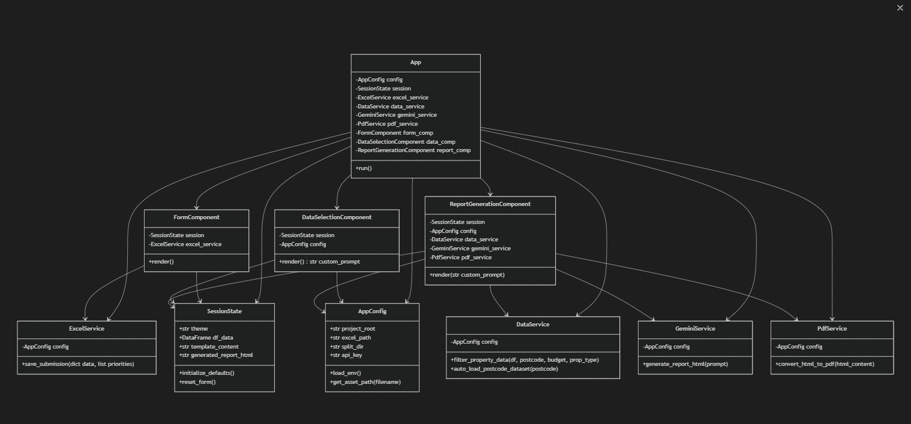
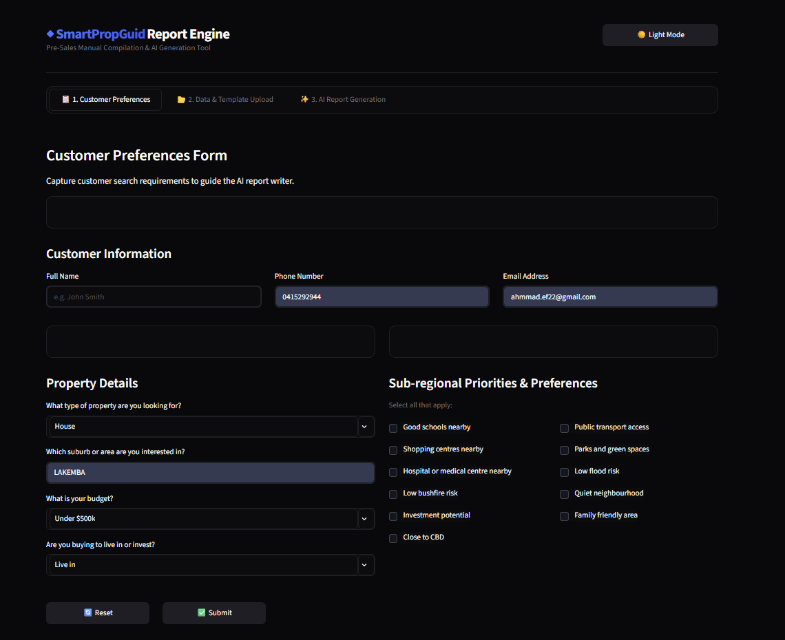
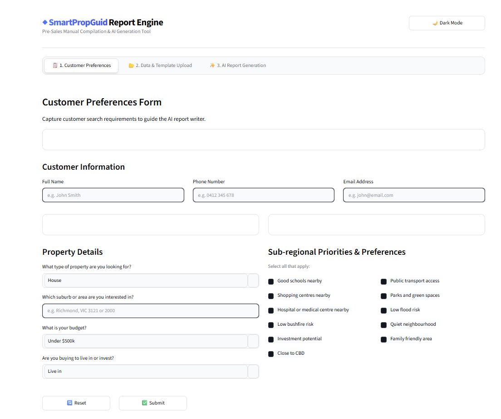

# SmartPropGuide ◆ Report Engine

An enterprise-grade Pre-Sales Manual Compilation & AI Generation tool built with **Python** and **Streamlit**. This repository automates the processing of customer property search requests, handles manual operator data compilation, and utilizes advanced generative AI models to compose beautifully structured, publication-ready real estate evaluation reports.

---

## 🏗️ System Architecture & Workflow

The platform handles the manual collection workflow in a streamlined 3-step pipeline designed for pre-sales operators:

### Architecture Diagram


### Pipeline Steps:

### 📋 1. Customer Preferences Intake
* Captures explicit user property criteria: target location/postcode, property layouts, exact budget distributions, and intention parameters (Owner-Occupier vs. Investor).
* Evaluates secondary priority weights using an interactive grid checklist mapping core environmental and lifestyle metrics (e.g., school boundaries, public transit access, proximity to the CBD, flood and bushfire risks).

### 📂 2. Data & Template Upload
* **Source Data Integration**: Supports both direct manual file uploads (`.csv`, `.xlsx`, `.xls`) and real-time automated data pulling via the **HTAG Suburb Analysis API** (`https://agent.htagai.com/micro-agents/agents/suburb-analysis/execute`).
* **Report Layout Pre-sets**: Injects customized HTML template files dynamically. Falls back automatically to the standard enterprise `sample_template.html` template when an alternative layout isn't loaded.
* **Operational Control Layer**: Provides custom directive text fields for operators to tell the AI model exactly what to prioritize during generation (e.g., target capital growth trajectories or transit vectors).

### ✨ 3. AI Report Generation & Compilation
* Leverages dual AI engine support: choose between **Google Gemini (`gemini-2.5-flash`)** and **Anthropic Claude (`claude-sonnet-4-6`)** via an interactive selector.
* Dynamically parses textual data streams, processes structured listings rows, maps scores, and handles real-time HTML string rendering.
* Seamlessly compiles raw HTML code into professional, portable documents using `playwright` for local download.

---

## 📁 Project Structure

The project has been refactored into a modular Object-Oriented design:

```
SmartPropGuid_Report_Gen_Gemini/
├── app.py                      # Main entrypoint & coordinator
├── sample_template.html        # Default report template
├── Cred.env                    # API Keys & Model Configuration
├── requirements.txt            # Package dependencies
└── components/                 # Application components and services package
    ├── __init__.py             # Package initializer
    ├── config.py               # AppConfig & SessionState class wrappers
    ├── ui_utils.py             # UI elements helper & CSS styles injection
    ├── services.py             # ExcelService, DataService, GeminiService, AnthropicService, HtagService, TemplateService, PdfService
    ├── form.py                 # Customer Preferences form component UI
    ├── data_selection.py       # Data preview, HTAG API fetcher, and template uploader component UI
    └── report_generation.py    # AI report generator and PDF download component UI
```

Each module has a single responsibility:
- **`App`**: Sets up page properties, custom styling, and routes the navigation tabs to components.
- **`AppConfig`**: Resolves local resources paths, sets environment setups, and loads API keys for Gemini, Anthropic, and HTAG.
- **`SessionState`**: Encapsulates properties in Streamlit state parameters.
- **`UiHelper`**: Separates loading spinner animations and injecting dark/light theme CSS properties.
- **`ExcelService`**: Appends customer intake sheet submissions safely.
- **`DataService`**: Manages filtering operations and autoloads postcode datasets.
- **`GeminiService`**: Interacts with Google Gemini AI for structured JSON report generation.
- **`AnthropicService`**: Interacts with Anthropic Claude for structured JSON report generation.
- **`HtagService`**: Connects to the HTAG Micro-Agent Suburb Analysis API to fetch live real estate metrics.
- **`TemplateService`**: Jinja2 rendering engine that safely merges JSON report content into HTML templates.
- **`PdfService`**: Executes a headless browser process to print the HTML report as a high-fidelity PDF.

---

## 🎨 Enterprise UI Design System

The application implements a custom dual-theme architecture supporting high-contrast Dark and Light view modes:
* **Dark Mode**: Sleek zinc-palette aesthetics optimized for extended night usage.
* **Light Mode**: Reconfigured typography, card elements, and form label bindings to lock text colors to rich high-contrast tones, ensuring readability.
* **Layout Isolation**: Default stream headers, toolbars, and branding footprints are isolated via deep CSS injections to deliver a branded interface.

---

## 🛣️ Development Roadmap

This roadmap outlines the past milestones, current active sprints, and upcoming features for the SmartPropGuide engine.

| Phase | Milestone | Status |
| :--- | :--- | :--- |
| **Phase 1: Foundation** | UI/UX Core Architecture & Frontend Framework | ✅ Done |
| | Integration of Gemini API Pipeline | ✅ Done |
| | Report Generation PDF Export Module | ✅ Done |
| **Phase 2: Validation** | Backend Data Sync: Excel Intake Form | ✅ Done |
| | OOP Structure Refactoring | ✅ Done |
| | User Acceptance Testing (UAT) | 🚧 Sprinted / Local Verification Pending |
| **Phase 3: Optimization** | Template Dynamic Styling Modules | ⏳ Pending |
| | Automated Email Delivery System | ⏳ Pending |

---

## 🚀 Execution & Setup

### Prerequisites
Ensure your local environment is running Python 3.9+ and contains an active Gemini API credential key.

### Installation
1. Clone the repository:
   ```bash
   git clone https://github.com/your-username/your-repo-name.git
   cd your-repo-name
   ```
2. Create and activate a virtual environment:
   ```bash
   python -m venv .venv
   # On Windows:
   .venv\Scripts\activate
   # On Linux/macOS:
   source .venv/bin/activate
   ```
3. Install dependencies:
   ```bash
   pip install -r requirements.txt
   ```
4. Set up credentials:
   Create a `Cred.env` file in the root directory and add your Gemini API key:
   ```env
   GEMINI_API_KEY=your_gemini_api_key_here
   ```
5. Run the application:
   ```bash
   streamlit run app.py
   ```

---

## 📸 App Screenshots

### Dark Mode Interface


### Light Mode Interface


